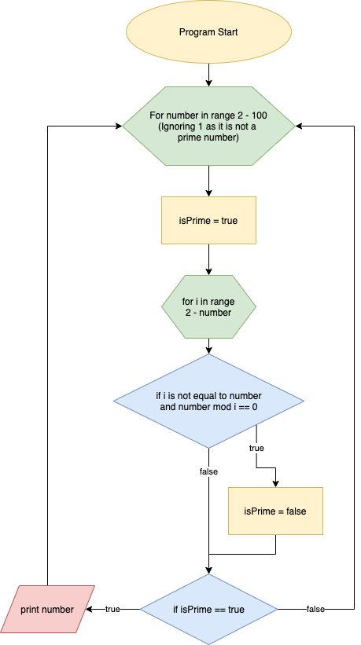

# Project - Workbook (T1A1)
## by Aaron Lewis

## Questions

### Question 1
**Research** the development of the internet from 1980 to today. You must describe at least FIVE key events in the development of the internet. You can refer to events, people of significance, or technologies and how they have changed over time.

1. *1980 - Introduction of the Ethernet Standard*

Known as the DIX Ethernet Standard, this is a communication specification for Local Area Network connections between computer devices. IEEE 802.3 provided the physical means for machines to communicate requests and pass information to each other, which is the main operating principle of the Internet and the first layers of the OSI Model. The initial coaxial cables were eventually replaced for higher speed, lighter weight options such as twisted pair cable, and fibre optic.

2. *1983 - Domain Name Systems*

As humans, and the primary users of the web, we would have a very difficult time remembering the IP addresses of all our favourite websites. Thanks to Elizabeth Feinler and the team behind ARPANet, this isnt a problem. DNS provides a naming system for computers, servers and other resources accessed by us via the Internet. Essentially a phone book for websites, the DNS will retrieve the entered website name, search its directories, and spit out the required numerical address to contact the appropriate server.

2. *1984 - The OSI Reference Model*

The OSI Model layers are as follows starting from the low level: Physical, Data Link, Network, Transport, Session, Presentation and finally Application. All these layers combined allow our machines to transmit and recieve data packets, encryption/decryption of network activity, transformation of data packets into readable information, and at the highest level, the actual software applications we end users interact with. Without the development of this model, we would not have the capabilities to handle data transmission across the globe, and would have a far more inept version of our Internet today.

3. *1988 - The Morris Worm*

Written by Cornell University student Robert Tappan Morris, the Morris Worm was one of the first Internet distributed viruses and the first to gain significant attention. While not created to be purposely damaging, and more to highlight security flaws in the current systems at hand, Within 24 hours of deployment, roughly 10% of the current ~60,000 machines connected to the internet were affected. The worm targeted computers running a specific version of UNIX with many top universities and even NASA being some of the casualties, slowing crucial functions to a crawl. The result of this program was a stark realization just how vulnerable computers had become, and caused cybersecurity to taken far more seriously.

4. **1990 - Archie Query Form and Search Engines*

The birth of the Search Engine. Archie Query Form was written in 1990 by McGill University student Alan Emtage. It kept an index of all FTP servers connected to the internet providing users with a way to access publicly available files and download them. Ideas like Archie led to the creation of the popular search engines we use today, such as Google, Duck Duck Go, or even Bing (unfortunely).

5. *1989 - 1990 - Web Browsers and the World Wide Web*

CERN employee Sir Tim Berners-Lee is the British computer scientist behind the creation of the World Wide Web. This includes the fundamental components that make up the Web we know as we know it; HTML, URL's (URI), HTTP and the creation of the Web Browser. In creating these technologies, Berners-Lee paved the way to how we surf the internet today, with web browsers becoming the main way a user interacts with content online. 

__Ref__: 
- https://en.wikipedia.org/wiki/History_of_the_Internet
- https://www.internetsociety.org/internet/history-internet/brief-history-internet/
- https://www.oreilly.com/library/view/ethernet-the-definitive/1565926609/ch01.html
- https://www.geeksforgeeks.org/layers-of-osi-model/
- https://en.wikipedia.org/wiki/Morris_worm
- http://www.searchenginehistory.com/
- https://webfoundation.org/about/vision/history-of-the-web/

### Question 2

**Define** the features of the following technologies that are essential in terms of the development of the internet:
 - packets
 - IP addresses (IPv4 and IPv6)
 - routers and routing
 - domains and DNS

 **Packets**: Every time you access the internet, your data transmissions are split up into ~1000 byte incriments called packets, and sent to its destination by the best calculated route. Packets are commonly split into 3 sections: Header, Payload and Footer.
 The header provides instructions about the data such as packet lengths, protocol information, destination and origin addressed. Payload is the bulk of the packet which contains the actual data being sent. Finally Footer (sometimes Trailer) contains end of packet information and error checking methods, most commonly CRC (Cyclic Redundancy Check).

 **IP Addresses**: Every device connected to the Internet has a unique identifying number attached to it. This number, your IP Address, allows you to look up other devices on a network, as well as allowing other devices to search for you. Basically an internet telephone number, with every online request you are pinging an IP address to establish the connection required for data transmission.

 **Routing and Routers**: Routers are used in the forwarding of data packets between computers and their networks, the gateway to the internet. Routers manage your data transmission traffic using certain routing protocols, taking your requests from your local network, and passing them through to the Internet. It also acts as security for intrusion from outside devices to your network, protecting your information from prying eyes. 

 **Domains and DNS**: Domains are the names we type into our URL bars to reach every website. They provide an easy to remember, convenient way to access web pages instead of the complicated series of numbers that servers actually identify with. Domain Name Servers are responsible for handling the conversion of Domains to IP Addresses and are often provided by your ISP. When you enter the name of a webpage into your URL bar, the DNS recieves the request, looks at its index of servers and finds the IP address attached to that domain name, returning the address to your browser and allowing you to continue with your internet surfing.

__Ref__:
- https://www.liveaction.com/blog/network-packet/
- https://www.howtogeek.com/341307/how-do-ip-addresses-work/
- https://geek-university.com/ccna/what-is-a-router/
- https://medium.com/@RadixRegistry/what-is-dns-and-how-does-it-work-domain-name-system-explained-bcb48c1ff61d


 ### Question 3

 **Define** the features of the following technologies that are essential in terms of the development of the internet:
 - TCP
 - HTTP and HTTPS
 - web browsers (requests, rendering and developer tools)

 **TCP**: Transmission Control Protocol (TCP) is a set of rules that allow two machines to communicate with each other over a network. It was designed to interconnect multiple networks to form what we now know as the Internet. TCP is often referenced as the Layer-4 protocols of the OSI model and is the process that splits up your data into packets, attaches source and destination information and error checking data, and passes it from one network to another. TCP has provided a way to transmit data that is reliable, and high-performance. TCP has proven to be the best method of data transmission, allowing for very low overhead, on the fly error checking, cross-platform communication between networks, and it is highly scalable allowing for new networks to be introduced to the system without disrupting existing ones. This allows our phones, computers, servers and such to run efficiently and assists hosts to recover quickly from data corruption or network errors.

 **HTTP and HTTPS**: Hyper Text Transfer Protocol is an application protocol designed to enable communication on the World Wide Web. When the user makes a request to visit a web server, HTTP takes the request and establishes the connection between the user and the desired server through the use of TCP. Once the server has received the request, it returns the information back to HTTP which carries the response back to the user. HTTP continues back and forth between the user and every server carrying every web page, video, image and line of text that makes up the websites you see in your browser. Without HTTP, the billions of people accessing the internet every day would have no means of retrieving the information required to view content online. HTTPS is simply HTTP with encryption. It uses TLS to encrypt the data being transferred between a web server and the client machine and secure the connection from unintended listeners.

 **Web Browsers**: The web browser is the primary method we use to interact with the online world and accounts for 95% of internet traffic. Users input URL address into the search bar, the browsers makes the request to fetch resources from the web server attached to the address and displays the content on the screen for the user. Your browser will send a _request_ for a specific file, often HTML but can be many different types, as HTTP or HTTPS. Once the server receives the request, providing it is valid, it will respond with the HTML and related content. You browser will now receive this response and render it for viewing by the user. _Rendering_ is handled in a few steps before it is displayed to the user, called the critical rendering path. First the HTML is processed and builds the DOM tree (the skeleton of the webpage in question), then the CSS markup is processed into a CSSOM tree which is combined with the DOM tree. This layout geometry is then computed and rendered onto the screen to be viewed by the user. _Developer Tools_ are a handy function that allows the client to inspect each element of a webpage and view its source code. This function while not often helpful to the average user, its incredibly useful to a developer, allowing us to view in real time which lines of code make up each element, and how changing this code effects the website.

 __Ref__:
 - https://www.techrepublic.com/article/exploring-the-anatomy-of-a-data-packet/
 - https://www.pickaweb.co.uk/kb/what-is-http/
 - https://medium.com/@monica1109/how-does-web-browsers-work-c95ad628a509

 ### Question 4 

 **Identify** THREE data structures used in the Ruby programming language and explain the reasons for using each.
 
 **Arrays**: Arrays are a container used to hold a list of objects. Arrays are used extensively in almost every project. Any time you need to hold a collection of related values for handling at some point in the program, the most basic way to do this is with an array. Arrays are useful in sorting and searching data, doing calculations with large sets of values. Instead of declaring large amounts of variables, you can declare one, and store as many values in it as you like.

 **Hashes**: Hashes are another way to store multiple values under a single variable. They differ from Arrays due to the fact that objects are stored in key-value pairs, the keys are unique strings and the values can be any type of object. Calling a key will return its value. This is very useful as you can store large data values that otherwise would be painful to call due to the length or complexity of the value, however you are able to use the easy to call 'key' name instead.

 **Stack**: Stacks are a container for data where the last value added is the first value removed. Index 0 is always at the bottom of the stack and you interact with the stack using Push and Pop. This data structer is used in many programs and can be useful for things such as Converting decimal numbers into binary numbers, or various solution strategies.

__Ref__:
- https://medium.com/amiralles/mastering-data-structures-in-ruby-recap-682a698b90d0

 ### Question 5

 **Describe** the features of interpreters and compilers and how they are different.

 **Compiled Languages** A compiler is essentially a translator. It takes the high-level languages that many programs are developed in, and converts it into machine language that a processor can understand. Compilers take in an entire program at once and generates the object code for reading by a machine. This means compilers are comparatively faster that Interpreters, however the memory requirement for this process is alot higher due to the large transformation into object code. A side effect of this large translation of code is that errors are displayed all at once after compilation. This makes error detection more difficult than its Interpreter couterpart. Some exampels of compilers enclude C, C++, VB and Java.

 **Interpreted Languages** Interpretors is the alternative for compilers, it translates programs line by line and displays error of each line one at a time. This is good and bad, on one hand, it is slower to convert into machine language than compilers are. However, with line by line error displaying, this makes error detection and debugging quicker and easier for the developer, hastening the development process. It also uses less memory than Compiled languages due to not generating any intermediate object code. Interpreted languages are often easier to write and more readable to the user, which is why languages such as Ruby, Python, Javascript or PHP have become so popular.

 __Ref__:
 - https://techdifferences.com/difference-between-compiler-and-interpreter.html

 ### Question 6

 **Identify** TWO commonly used programming languages and **explain** the benefits and drawbacks of each.

**C**: C could be called the grandfather of many other programming languages. Because of this, learning C gives you a skillset highly transferable when picking up other languages in the future. It is a robust, powerful and efficient language containing many data types, data structures and operators to give you a huge platform to create all sorts of programs. C is flexible, because it is machine independent you can run it on any machine while only maybe having to make a few changes to your source code. This is helpful to developers who want to build cross-platform systems. C is very structured, so complex problems are divided into smaller functions, making testing and maintenance far easier for the developer. Because it is classed as a mid-level programming language, this means it gets the good parts of high and low level programming allowing support for kernals and drivers, as well as system software applications in high-level programming languages. As far as the negatives, no support for Object Oriented Programming is a large downfall. With OOP becoming very common practice in the industry today, being confined to a procedural programming approach doesnt leave much to be desired. Being a compiled language, the process of error checking can prove difficult with the compiler showing all the errors AFTER writing the program, leaving a complex web of errors to sift through. C also has no Exception Handling, which is a very nice feature of other languages allowing you to catch errors and return appropriate responses instead of breaking your entire program. 


**Python**: Python is a f*cking great language. Its open source, which allows for a HUGE variety of libraries and modules available to anyone. From data visualization, to math plotting, actuator control, machine learning, game development, image processing, facial recognition and scientific computation, you name it, theres likely a python library to handle it. This allows python to be incredibly versatile, whilst still being very easy to learn and write thanks to its high level of abstraction. Its also OBJECT ORIENTED!!! This allows for great modularity, meaning ease of troubleshooting and great reusability and flexibilty of code, which is becoming the choice of many companies in the industry for all its benefits in the development process. While it is my favourite language, it still has its downsides. Due to it being on the more memory intensive side, it can be considered slower than some languages, and is also not very supportive of multi-threaded processing. To most, this isnt an issue, but it definietly restricts the intensity of programs that can be developed. Python also has no real support for mobile development, as neither iOS or Android natively support python for their applications. It can be done, but its a bit of a pain. The end. Python's great. 

__Ref__: 
- https://data-flair.training/blogs/advantages-and-disadvantages-of-c/
- https://www.netguru.com/blog/python-pros-and-cons-what-are-the-benefits-and-downsides-of-the-programming-language


### Question 7

**Identify** TWO ethical issues, and **discuss** the extent to which an IT professional is ethically responsible in terms of the issue.

**Aggressive sales and marketing practices designed to mislead and deceive consumers**

The Australian Computer Society released their own Code of Ethics to which every ACS Member is expected to follow. Principle 3 of the ACS Code of Ethics states;
"Honesty. You will be honest in your reputation of skills, knowledge, services and products". This ethical issue of the misleading, or deceipt of consumers directly violates
the honesty princible of our Code of Ethics. This ensures all developers make the correct decisions in regards to any work they partake in and protects end users from malicious intent.

**Access to a user’s personal information (medical, family, financial, personal attributes such as sexuality, religion, or beliefs)**

All software engineers are expected to adhear to a code of conduct developed by the IEEE known as the "Software Engineering Code of Ethics and Professional Practice"
This document is intended to act as a standard for the teaching and practice of software engineering. This is comprised of eight main principles, one of which applicable to
the access of users personal information reads "1. Public. Software Engineers shall act consistently with the public interest." This principle can be used for protection and privacy of users sensitive information as the sharing or misuse of user data is most certainly not consistent with public interest.

Consider the folling case study:

**Case Study**

>Leikessa Jones owns her own consulting business, and has several people working
for her. Leikessa is currently designing a database management system for the personnel
office of ToyTimeInc., a mid-sized company that makes toys. Leikessa has involved
ToyTimeInc management in the design process from the start of the project. It is now
time to decide about the kind and degree of security to build into the system.
Leikessa has described several options to the client. The client has decided to opt
for the least secure system because the system is going to cost more than was initially
planned, and the least secure option is the cheapest security option. Leikessa knows that
the database includes sensitive information, such as performance evaluations, medical
records, and salaries. With weak security, she fears that enterprising ToyTimeInc
employees will be able to easily access this sensitive data. Furthermore, she fears that the
system will be an easy target for external hackers. Leikessa feels strongly that the system
should be more secure than it would be if the least secure option is selected.
Ms. Jones has tried to explain the risks to ToyTimeInc, but the CEO, the CIO, and
the Director of Personnel are all convinced that the cheapest security is what they want.
Should Jones refuse to build the system with the least secure option?

In this example, we face the choice of not appropriately protecting sensitive user data. The client is ignoring our security advice and wants to proceed with the creation of a platform vulnerable to attack. In this instance we can refer to both of the legal codes of conduct previously listed to help us make the correct ethically sound decision. First we will examine which ethical issues are applicable in this case. The developer knows that the database will include "sensitive information, such as performance evaluations, medical records, and salaries". Immediately this is an ethical issue of access to users personal information. Another ethical issue relating to the IEEE standards is raised in regards to knowingly releasing a product that it sub-par to what the program needs to be. 

If the developer in question is really unsure in this situation, we can look at a few principles of both the "ACS Code of Ethics" and "Software Engineering Code of Ethics and Professional Practice". Principle 1 of both documents state that actions taken by a software engineer should act in accordance with the interest of the public. Again, not appropriately protecting the publics data would violate these terms. Rule 2 of the Software Engineering Code of Ethics and Professional Practice also talks about acting in a manner that is within the clients best interest, however clearly states that it also has to be consistent with public interest. Principle 2 of the "ACS Code of Ethics" also states that we as Engineers will strive to improve the quality of life of those affected by our work. This is just another easy example of this condition not lining up with our current situation and the requests of our client, as the users who's data will be stored in this database will now be exposed to threats towards their sensistive information.

We are also able to use Principle 3 of the Software Engineering Code of Ethics and Professional Practice, Product. Software engineers under this document are expected to ensure that their products and related modifications meet the highest professional standards possible. The developer is aware that the client is requesting sub-optimal security measures for their database, so we know for a fact that this is not up to the professional standards required. Priciple 6 of the SECEPP also covers the Software Engineer acting with integrity, and upholding the reputation of their profession. With all these principles, it makes our decision much more clear on how to act appropriately and ethically towards the client and the end users of this platform. The correc decision to make would be to refuse development of this platform unless the client accepts the need for higher quality security measures to be put in place.

If any developer is confused on what actions they should take during their career, it is a wise decision to refer to these Code of Ethics documents, and any other documents from their employer which may be applicable, in order to ensure they are consistently making ethical decisions, protecting the users, themselves and their clients along the way.

__Ref__: 
- https://www.researchgate.net/publication/278417404_Software_Engineering_Code_of_Ethics_and_Professional_Practice
- https://www.acs.org.au/content/dam/acs/acs-documents/Code-of-Ethics.pdf
- https://web.cs.wpi.edu/~jb/CS3043/Readings/06%20-%20Ethics/EthicsCaseStudies.pdf?fbclid=IwAR0gIJlQQPgTzIfn8eWXT6p6RENu7rXX3txmWRTCMzrNfJy5qDUKJu0j96A

### Question 8

Explain control flow, using an example from the Ruby programming language.

In regards to programming languages, control flow is the order of operations that will be executed. This includes statements, assignments and method calls. Certain programming languages have different Control Flow Statements, which determines which line of code is being run in a program at any time. An example includes:
```ruby
def controlFlow
    if x == 1
        puts "x is equal to 1"
    else
        puts "x is not equal to 1"
    end
end
```
In this ruby example we can look at how the if statement handles control flow. The if keyword is used to check if the specified condition is true or false. If it is true, it will execute the block of code under it, until the next keyword (else, elsif or end). If the condition is false, the control flow will ignore the code block and continue to the next keyword, in this case "else", which will execute its following block of code if all the previous conditions failed.

### Question 9

**Explain** Type coercion.

**Type Coercion** is the conversion of a value from one data type into another. There are two types of Type Coercion: Explicit and Implicit.
Explicit Type Coercion is when the conversion of types is expressed with a method designed to do so. In ruby an example would be the .to_s, .to_i, and .to_a methods, eg. 100.to_s would convert to a string of "100".

Implicit conversion is automatically handled by the language compiler when you apply operators to values of different compatible types, 
eg. 5 * 2.0 = 10.0 (int to float), or '5' - 5 will return 0 (str to int). Some strong typed languages do not support this. If incompatible data types are used together, the compiler will often return a Logic Error.

## Question 10

**Explain** data types.

**Data Types** for most languages can be catagorized into three different forms: Strings, Numbers and Booleans. These different types tell the compiler/interpreter how to handle the data assigned to that type. 

**Strings**: can be made up of words, single characters, whitespace and symbols. Eg:
```ruby
myString = "This is an example of a string!"
myOtherString = " " # This is also a string
myOtherOtherString = "100" # This is also another string
```
**Numbers**: can be handled as a few different types depending on the language. Integers are whole numbers, floating points are decimal numbers.
```ruby
myNum = 12 # This is an integer
myOtherNum = 5.5 # This is a floating point
```
**Booleans**: are a binary value. They can be either true or false.
```ruby
myBoolean = true
myOtherBoolean = false
```

### Question 11

**Here’s the problem:** “There is a restaurant serving a variety of food. The customers want to be able to buy food of their choice. All the staff just quit, how can you build an app to replace them?”

 - Identify the classes you would use to solve the problem
 - Write a short explanation of why you would use the classes you have identified

 **Classes**:

In order to determine the classes I would need to replace the employees, I first analysed the staff requirements to run the restaurant. I decided I would need a manager, a chef, two cooks, a dishwasher and a few wait-staff. 

I would start with an 'Employee' super class, which would have attributes of a name and weekly hours. This class can be used to handle the common attributes of all the subclasses.

I would then define Subclasses to define all the specific roles, which would include:
- Manager, who would have methods for tracking inventory, resupplying stock, handling payroll and training other employees.
- Chef, who would be able to make special dishes, cook basic meals and train cooks.
- Cooks, to handle meal prep and cook basic meals.
- Dishwashers, to retrieve and wash dirty dishes.
- Wait staff, which would have methods to seat customers, set tables, take orders, serve dishes and drinks, and process payments.

With each of these rolls now handled by an Android programmed with these Classes, there should be enough robotic employees to keep the restaurant running and the patrons happy.

### Question 12

***Identify and explain*** the error in the code snippet below that is preventing correct execution of the program.
```ruby
celsius = gets
fahrenheit = (celsius * 9 / 5) + 32
print "The result is: "
print fahrenheit
puts "."
```
The error in this code snippet lies in the line `celsius = gets`. Gets, by default, will interpret the user input as a string data type, and will assign it to the 'celsius' variable as such. This is causing a logic error when the program tries to execute the next line of code, as you can't do math using a string, leading to the program breaking. In order to correct this, the input line of code should be changed to `celsius = gets.to_i`. This will take the user input and convert it into an integer, ready to be handled by the next equation and returned correctly.

### Question 13

The code snippet below looks for the first two elements that are out of order and swaps them; however, it is not producing the correct results. Rewrite the code so that it works correctly.

```ruby
arr = [5, 22, 29, 39, 19, 51, 78, 96, 84]
i = 0
while (i < arr.size - 1 and arr[i] < arr[i + 1])
	i = i + 1 end
puts i
    arr[i] = arr[i + 1]
    arr[i + 1] = arr[i]
```
Most of the code was functional, the only part that required changing was the last two lines. You can't swap values like that, it'll only result in both values being equal to whatever arr[i + 1] was originally. Below is a way you can handle that kind of swap.

```ruby
arr = [5, 22, 29, 39, 19, 51, 78, 96, 84]
i = 0
while (i < arr.size - 1 and arr[i] < arr[i + 1])
    i = i + 1 
end
arr[i], arr[i + 1] = arr[i + 1], arr[i]
puts arr
```

### Question 14

Demonstrate your algorithmic thinking through completing the following two tasks, in order:
 1. Create a flowchart to outline the steps for listing all prime numbers between 1 and 100 (inclusive). Your flowchart should make use of standard conventions for flowcharts to indicate processes, tasks, actions, or operations
 1. Write pseudocode for the process outlined in your flowchart

**1. Flowchart**



**2. Pseudocode**

```
Begin loop for numbers between 1 - 100 (can exclude 1 as it is not a prime number)

    Assign isPrime variable to true

    Begin second loop for range of 2 - current number

        if i is not equal to current number and current number mod i does not equal 0

            set isPrime to false
        
    if isPrime is currently true

        print current number
        
    return to start of first loop.
```

### Question 15

Write pseudocode OR Ruby code for the following problem:
You have access to two variables: raining (boolean) and temperature (integer). If it’s raining and the temperature is less than 15 degrees, print to the screen “It’s wet and cold”, if it is less than 15 but not raining print “It’s not raining but cold”. If it’s greater than or equal to 15 but not raining print “It’s warm but not raining”, and otherwise tell them “It’s warm and raining”.

```ruby
raining = true
temperature = 32

if raining && temperature < 15
    puts "It's wet and cold"
elsif !raining && temperature < 15
    puts "Its not raining but cold"
elsif temperature >= 15 && !raining
    puts "It's warm but not raining"
else
    puts "Its warm and raining"
end
```

### Question 16

An allergy test produces a single numeric score which contains the information about all the allergies the person has (that they were tested for). The list of items (and their value) that were tested are:
 - eggs (1)
 - peanuts (2)
 - shellfish (4)
 - strawberries (8)
 - tomatoes (16)
 - chocolate (32)
 - pollen (64)
 - cats (128)

So if Tom is allergic to peanuts and chocolate, he gets a score of 34.

Write a program that, given a person’s score can tell them:
 a) whether or not they’re allergic to a given item
 b) the full list of allergies.

**Program**:

```ruby
def isAllergic(score)
    allergyHash = {
        "cats" => 128,
        "pollen" => 64,
        "chocolate" => 32,
        "tomatoes" => 16,
        "strawberries" => 8,
        "shellfish" => 4,
        "peanuts" => 2,
        "eggs" => 1
    }
    allergenArr = []
    allergenScore = score
    allergyHash.each do |allergen, value|
        allergenScore -= value
        if allergenScore < 0
            allergenScore += value
        elsif allergenScore == 0
            allergenArr.push(allergen)
            break
        elsif allergenScore > 0
            allergenArr.push(allergen)
        end
    end
    puts "Out of the following allergens tested: "
    puts allergyHash.keys
    puts "You are allergic to:"
    puts allergenArr
    
end

isAllergic(96) #test returns pollen and chocolate, as expected.
```
