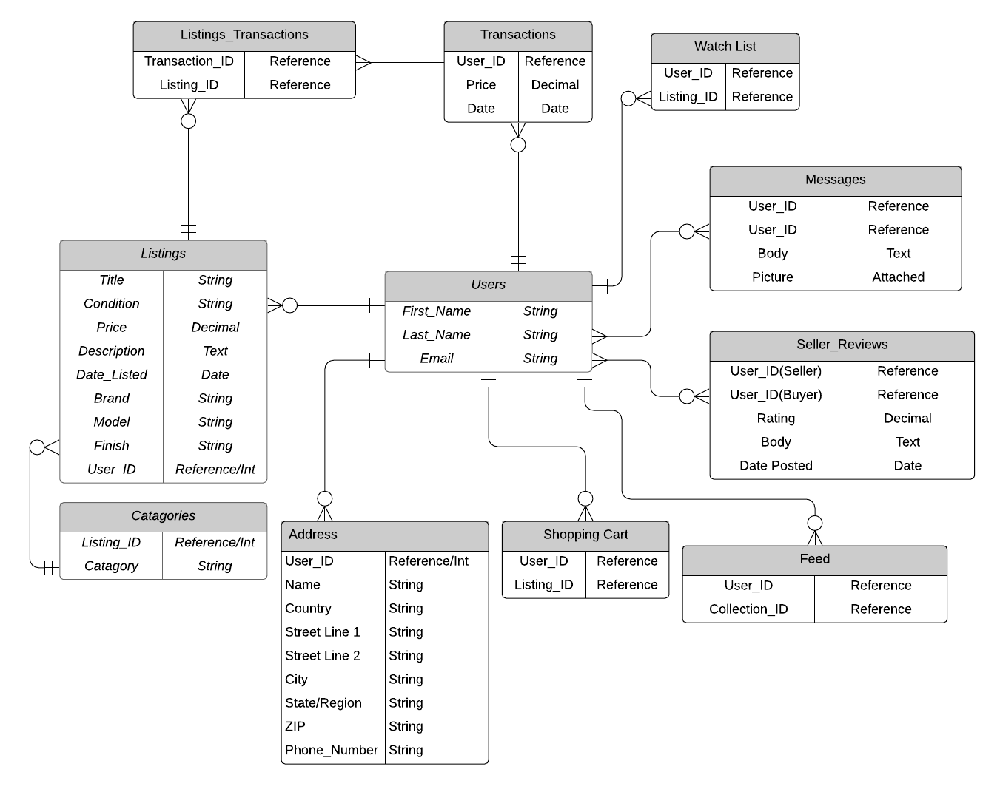

# Project - Workbook (T2A1)

## by Aaron Lewis

## Questions

### Question 1

**Describe** the architecture of a typical Rails application.

Ruby on Rails is one of many examples of an M-V-C architectural pattern. This pattern has become very popular due to its ease of collaboration between developers, rapid application development and updating, quick addition of new features to existing applications and simplification of debugging as all the components are separated when written properly. The idea of MVC is to split your application into 3 components; Models, Views and Controllers. Each component has a specific purpose, Models handle data storage/structure and interaction with the database, Views handle all the page layout and user interaction, and Controllers handle all the business logic/functions of your application. Rails is a convention over configuration framework, which requires developers to follow a specific set of rules when creating their application allowing in-built functions and relationships to be established very quickly. However, if you were to deviate from these standards, you will face errors until you correct it back to the Rails way. Rails web applications are often hosted on a web-server such as Puma, and operate by routing HTTP requests send from a users machine over the internet to specified controllers and functions of your application which will return the appropriate data to the users browser.

**Ref**:

- https://www.interserver.net/tips/kb/mvc-advantages-disadvantages-mvc/

### Question 2

**Identify** a database management system (DBMS) commonly used in web applications (including Rails) and discuss the pros and cons of this database.

**SQLite**

SQLite is an open-source Relational Database Management System which boasts the features of being self-contained, server-less and zero configuration. SQLite also comes packaged by default with Rails.

**Pros**: 
- SQLite is Open Source, which is a huge bonus for any developer. This allows full use of the database within your application for any purpose, free of charge. 
- Its very small! SQLite is completely self contained, compact library and can be as small as 600KiB. This is a big bonus on applications running with very limited storage options, leaving more room for usable data. 
- SQLite does not support client-server negotiation. As a result, accessing the database is much faster, and data is much easier to secure as you can protect your database as you would any other file, with no need to worry about malicious incoming requests.

**Cons**: 
- SQLite misses out on some SQL queries and syntax. This can limit its uses to certain applications, and can also make it difficult to transition from another DBMS into SQLite, if the previous application relied on these missing queries. 
- Not great for large-scale databases. For lightweight applications with limited file sizes, this doesn't prove an issue, however if you start storing files over 1GB, it is common to see large increases in memory usage by SQLite. While it is claimed to support databases up to 2 terabytes, it is not ideal. 
- SQLite is also not great at handling multiple requests from different clients at the same time. It will lock writing permissions if someone is reading the data entry, and could cause errors/delays in a busy-traffic scenario.

**Ref**:

- https://www.sqlite.org/about.html
- https://h3rald.com/articles/quick-overview-of-sqlite/

### Question 3

**Discuss** the implementation of Agile project management methodology.

**Agile Software Development** is one of many software development approaches. It builds on the idea of iterative development where the software is built and delivered to the client in increments. Implementing this into the development of your project allows for rapid progression and somewhat fluidity in the addition of new features and changing requirements. In order to implement Agile techniques, you need to adhere to a set of principles.

- Encourage heavy communication between stakeholders and developers. This will ensure that flexibility of design is maintained and that the final product adheres to the clients most recent requirements.
- Aim to deliver in frequent iterations. This allows your client to see up-to-date progress and inform you of any changes or additions while you're developing the next iteration. Always remain receptive to changes from your client, as this will only benefit the application and customer satisfaction.
- Work at a sustainable pace. Ensuring the development of your application is not hindering the performance of team members and users is crucial to the creation of a quality product. With everyone at a comfortable pace, you don't need to worry about developers burning out, and you can be sure to deliver working software in the agreed timeframe.
- Review and reflect with the team at regular intervals. This can highlight issues effecting performance or concerns between team members, strategise the next steps of development and allows the team to adjust its approach and behaviour accordingly.

**Ref**:

- https://www.agilealliance.org/agile101/12-principles-behind-the-agile-manifesto/
- https://plan.io/blog/ultimate-guide-to-implementing-agile-project-management-and-scrum/

### Question 4

Provide an **overview** and **description** of a standard source control workflow.

Source/version control has become a crucial part in the software development cycle and collaboration of multiple developers. With more than one person working on an application, alterations to files can get out of hand very quickly. This is where the implementation of Source Control Management comes in. The normal workflow of a source control starts with the creation of a repository, this is where all the files associated with the application are held. The master branch is then defined which is where final changes from developers are pushed when the code is confirmed to be appropriate, reliable and production ready. Each developer can create their own branch, where they can work on the tasks they have been assigned without affecting the other developers' work. Once the team is happy with a new function or module, they can merge their branches into a testing branch or the master branch, where the version control will sort through all the changes made and gracefully mesh them together, providing there are no conflicts between files.

**Ref**:

- https://build5nines.com/introduction-to-git-version-control-workflow/

### Question 5

Provide an **overview** and **description** of a standard software testing process (e.g. manual testing)

Software testing is categorised into a few forms, which take place throughout the development process. One form of this is known as Regression Testing. As the development cycle progresses and the application grows and morphs, it is a good idea to carry out regression testing to make sure that the application still functions as it did prior to recent changes. At any point during the addition of features or alteration of existing code, functions within your program can decide to operate completely different to what you initially designed. Methods of regression testing include:
- Retest All: This is the most time-consuming and resource intensive method, as it requires running all tests in your entire application.
- Regression Test Selection: This allows you to run a select set of tests relating to any code changes that have been recently made, reducing wasted time.
- Prioritisation Testing: Selection of test cases based upon impact to the business, frequently used functions etc. By prioritising the correct operation of critical functions of your application, you can reduce the number of tests required during your development.

**Ref**:

- https://usersnap.com/blog/software-testing-basics/
- https://www.guru99.com/regression-testing.html

### Question 6

**Discuss** and **analyse** requirements related to information system security and how they relate to the project.

In the digital age, cyber security and protecting your application's data has become one of the most crucial aspects, especially for a web application. If your application houses sensitive user data such as names, addresses, phone numbers/emails, medical records or payment information, it is the responsibility of all IT professionals to ensure that appropriate measures have been put in place to negate malicious attacks. Some examples of potential threats to the security of your web application include:

- Cross-Site Request Forgery: This allows the attacker to trick the user into performing payment transactions, password changes and other malicious actions without the knowledge of the user. I will need to ensure the correct authentication checks are carried out in my web application to avoid this.
- Injection Attacks: One of the more common attacks, Injection (or SQL Injection) uses forms/urls to enter malicious SQL requests which have the potential to return user accounts, passwords and other sensitive data, or even destroy whole tables of data. To reduce the risk of this in my application, I should carry out proper sanitising of all data entries.
- Malware (Malicious Software): Malware is described as any software that is designed to be harmful to users/systems. Worms, Trojans, Spyware, Ransomware or Viruses are all some buzzwords that relate to malware in general. Proper firewall implementation is key in the defence of these malicious software's for your application and users. Luckily the methods of building and hosting my web application should include enough security to protect against this.
- Phishing Attacks: These attacks are often in the form of emails, direct messages or phone calls and attempt to trick users into providing sensitive information to an attacker by disguising the attack as a commonly known web-page, where the user can enter usernames, passwords, even payment information which will be sent straight to the attacker. When it comes to my web application, this could be harder to protect against as it often comes down to common sense, but ensuring your users that they should never respond to unsolicited requests for their personal information is very important.

**Ref**:

- https://www.cgisecurity.com/csrf-faq.html
- https://www.imperva.com/learn/application-security/sql-injection-sqli/
- https://www.malwarebytes.com/malware/

### Question 7

**Discuss** common methods of protecting information and data and how you would apply them to the project.

The protection of an applications information/data is extremely important as there are often legal obligations attached to protect the users and their online presence. Common forms of data protection include:

- Authentication: Implementing a login system whether that be through Cookie/Session authentication, Web Tokens or OAUTH can go a long way in the protection of your data. By requiring a user to log in to perform certain actions, you are creating a barrier against intrusion from unrelated/unauthorised third-parties. Using the Devise gem will be a quick and secure way of ensuring proper authentication within my application.
- Encryption: By disguising sensitive data using an encryption method, you can prevent the risk of potential intruders being able to read the plain-text in your databases. In the event that someone did gain access to your database tables, they would only be met with encrypted strings of text, which they would have no way of decrypting. Data within my application that needs to be encrypted will include user account information, and transaction information. The Stripe and Devise gem come included with the appropriate forms of encryption and security to protect against attacks.
- Role Management: Setting certain permissions for specific roles is a fantastic way to limit and monitor the actions that users can take on your applications. Eg. You wouldn't want a low-level user having write access to important sections of your application, you would leave those permissions for moderators or administrators. In order to ensure appropriate permissions are assigned to users, I will need to set a specific administrator account for the management of the website, and make sure users are only about to read listings and alter their own listings.

__Ref__:
- https://www.okta.com/security-blog/2019/02/the-ultimate-authentication-playbook/
- https://www.freecodecamp.org/news/how-does-devise-keep-your-passwords-safe-d367f6e816eb/

### Question 8

**Research** what your legal obligations are in relation to handling user data and how they can be met for the **project**.

Businesses may need to abide by guidelines outlined in the Privacy Act 1988 given they fit a certain number of requirements (eg. Having an annual turnover >$3m, or being a certain type of small business), or opt-in to the Privacy Act. Some of these guidelines include:
- "Open and transparent management of personal information": Ensuring a sense of transparency with your users in the ways you handle and use their personal information.
- "Security of Personal Information": Implementing appropriate measures to secure sensitive information from malicious attacks.
- "Anonymity and pseudonymity": Enabling users to operate within your domain anonymously or under a pseudonym.

Due to the small nature of my project, in a legal sense, I don't have to go overboard with protecting user data. I am mainly concerned with account passwords and payment/transaction information. Because the gems I plan to use have inbuilt methods of adequately protecting this information, my responsibilities have been met. I could allow users to have a custom username, aside from their name for the shipping address, which would abide closer to the guidelines outlined in the Privacy Act.

__Ref__:
- https://www.business.gov.au/Risk-management/Cyber-security/How-to-protect-your-customers-information
- https://www.oaic.gov.au/assets/privacy/guidance-and-advice/app-quick-reference-tool.pdf

### Question 9 

**Describe** the structural aspects of the relational database model. Your description should include information about the structure in which data is stored and how relations are represented in that structure.

The relational database model is featured in some of the most popular Database Management Systems used today. It has many advantages to its composition such as its query flexibility, making complex search queries easy for developers and users. Relational databases also make use of normalisation to make it easy to read data within the database.

Relational databases are made up of a few concepts:
- Tables: Every data input is stored in a row of a specific table, and every attribute is defined by the columns of the table.
- Columns/Attributes: Each column in a table represents a certain attribute value of every data entry. (Eg, for a Users table, columns would include: Username, Email, Password)
- Primary Key: Every table has a column for a unique identifying number for each row/tuple. This is the tables Primary Key, and its used for referencing any specific row in a table ie. Search queries, deleting specific rows etc.
- Foreign Key: This is a column within a table that references the Primary Key of ANOTHER table. This can be used for creating relationships between table rows (eg. A book table might have a Foreign Key for an Author table.)
- Tuples/Rows: This is where each unique data input is stored. Every row within a table holds the attribute values for a single Object.

__Ref__:
- https://www.guru99.com/relational-data-model-dbms.html

### Question 10

**Describe** the integrity aspects of the relational database model. Your description should include information about the types of data integrity and how they can be enforced in a relational database.

In the digital age, the quality and reliability of stored data is becoming very importance to businesses as the integrity of your databases can directly impact costs and overall efficiency. A number of factors have an impact on your data integrity:

- Data accuracy and consistency with overall formatting and data types.
- Duplicate or unnecessary data in your databases.
- Data relationships and ensuring everything is linked appropriately.
- Threats from cyber attacks/malicious software.

It is a good idea to implement methods of reducing the risk of data integrity issues. This can include:

- Validating data input: Whether that be through form types, requirement checking etc, it is good practice to validate data before its even entered into a database.
- Scheduled cleaning of database entries: By routinely inspecting for duplicate data, orphaned tables and other data errors, its easy to keep on top of the condition of your databases as well as reducing storage costs and general bloating.
- Roles/Permissions: By controlling who has access to certain sections of data, you can reduce the risk of both human error whilst working in a database and any potential attacks from third parties.

__Ref__:
- https://blog.kyoceradocumentsolutions.com.au/what-is-data-integrity
- https://www.promptcloud.com/blog/7-steps-to-improve-data-integrity/
- https://afteracademy.com/blog/what-is-data-integrity

### Question 11

**Describe** the manipulative aspects of the relational database model. Your description should include information about the ways in which data is manipulated (added, removed, changed, and retrieved) in a relational database.

Manipulation within a relational database is handled in two fashions; Relational Assignment Operators, and Relational Algebra.

Relational Assignment Operator is how updates to data entries are handled. The INSERT operator is used to insert single or multiple records into a table. UPDATE is used to alter attributes with new values defined by the query. DELETE is used to destroy single or multiple records from a table. The last main operator is SELECT, which is used to retrieve records from a database. This operator can be combined with specific conditions to filter the records that are returned, ie. ```SELECT * FROM table_name WHERE x > 10``` This query will return all records from the  table_name table, where the x attribute is greater than 10. Very useful for developers who want a certain set of data returned from a database.

Relational algebra makes use of concepts such as Set Theory to compare and retrieve new relations from old ones. Common ideas such as Intersect and Difference will return a corresponding set of relations from the comparison of two other sets of relations. Queries such as Union will return all tuples within either or both of two seperate sets of records.

__Ref__:
- https://www.oreilly.com/library/view/sql-and-relational/9781449319724/ch01s04.html
- http://etutorials.org/SQL/SQL+Bible+Oracle/Part+IV+Retrieving+and+Transforming+Data/Chapter+11+SQL+Operators/Assignment+Operator/
- https://www.w3resource.com/sql

### Question 12

**Identify** and **explain** the workings of TWO sorting algorithms and discuss and compare their performance/efficiency (i.e. Big O) 

**Bubble Sort**

Bubble Sort is one of the most basic sorting algorithms with a very simple method of sorting. The basic idea is that bubble sort performs multiple passes on a data set, swapping adjacent values if they aren't in the correct order. Once all values are in order, the algorithm will stop its passes and return the sorted set. The time complexity for this sorting algorithm is known as Quadratic or O(n^2). What this means is that for n (the number of items in a set), the number of steps required to sort the entire set is n squared. This isn't a very practical sorting algorithm, because as the size of your set increases, the amount of time required to complete the sort increases rapidly, and will often render applications useless after a certain data size. This quadratic time complexity is common for any algorithm that makes use of nested loops.

**Quick Sort**

Quick Sort is a much more efficient algorithm than the prior, and operates in a slightly more complicated fashion. This algorithm starts by choosing a pivot point (where the point is doesn't really matter), then the idea is to arrange the elements LESS than the chosen point to the left of the pivot, and the values GREATER than the pivot to the right! This process is continued with new pivot points until a sorted array is returned. This algorithm has a time complexity of O(n log n) or logarithmic/linearithmic time. This means that execution time for the sort grows in proportion to the logarithm of the set size. The first 'n' in 'n log n' is often ignored due to it being a fairly trivial effect to the running time when the set size is very large, we are mainly focussed on the 'log n'. Each time through the loop, the data set to search or sort is halved, so in a worst case, the algorithm will require log n steps.

**Comparison**

Domain: A set of 10 items, very small scale.
Number of steps to sort with Bubble: O(10^2) = 100
Number of steps to sort with Quick: O(10 * log2(10)) = 40

Domain: A set of 10,000 items.
Number of steps to sort with Bubble: O(10000^2) = 100,000,000
Number of steps to sort with Quick: O(10000 * log2(10000)) = 140,000

As you can see, the difference in steps between the two algorithms changes drastically as you increase the set size, highlighting the importance of a good algorithm.

__Ref__:
- https://www.geeksforgeeks.org/bubble-sort/
- https://medium.com/human-in-a-machine-world/quicksort-the-best-sorting-algorithm-6ab461b5a9d0
- https://adrianmejia.com/most-popular-algorithms-time-complexity-every-programmer-should-know-free-online-tutorial-course/

### Question 13

**Identify** and **explain** the workings of TWO search algorithms and discuss and compare their performance/efficiency (i.e. Big O)

**Linear Search**

Linear Search algorithms are very straight forward, start from the beginning on a data set, and move through value by value until you find a match then return the index position of that match. No surprise, the time complexity is linear or O(n), the algorithm execution time grows directly with the set size. This is a pretty good time complexity, however it's not the most efficient method to find a value in a set. Imagine the set is a million items long, and the value you're looking to match with is the last in the set, it will require the maximum execution time to find it. Realistically, it wouldn't take that long to find, but there are better ways to possibly find it faster.


**Binary Search**

Binary Search used the "Divide and Conquer" method of searching. This algorithm searches a sorted array by starting at the mid-point and recursively dividing the set in half, depending on if the value being searched for is higher or lower than the current midpoint. If the value is higher than the current midpoint, the set will halve to a new set, starting from the mid-point to the end of the original set. A new mid-point is set, and the same function is run until the mid-point matches the desired value, and it is then returned. The same concept applies if the value is smaller than the midpoint, the new array will just start from the beginning of the set, and end at the previous midpoint of the last set. This sorting algorithm manages a time complexity of O(Log n), as every time the set is searched, the set size is halved until a match is found. This proves much more effective in larger data-sets.

**Comparison**

Domain: A sorted set of 10 numbers.
Number of steps to sort with Linear: O(10) = 10
Number of steps to sort with Binary: O(log2 10) = 4

Domain: A sorted set of 10,000 numbers.
Number of steps to sort with Linear: O(10000) = 10000
Number of steps to sort with Quick: O(log2(10000)) = 14

Once again, very large difference in steps once the data sets reach a large enough amount, and the difference only gets bigger and bigger. This example as well as the previous sort example proves how crucial an appropriate algorithm is when your application is handling extremely large sets of data.

__Ref__:
- https://www.geeksforgeeks.org/linear-search/
- https://stackabuse.com/binary-search-in-java/


### Question 14

Conduct **research** into a marketplace website (app) and answer the following parts:

**a. List and describe the software used by the app.**

I have chosen to conduct research into https://reverb.com/, a musician oriented marketplace for the sale of both new and used music equipment.

The tech stack utilised by Reverb.com includes:

- Rails: a server-side web application framework written in Ruby.
- jQuery: a javascript library.
- PostgreSQL: a free and open-source relational database management system.
- Amazon EC2: allows users to rent virtual computers on which to run their own applications.
- Cloudflare: a web-infrastructure and website-security company.
- Akamai: a global content delivery network, cybersecurity, and cloud service.
- Google Analytics: a web analytics service offered by Google that tracks and reports website traffic.

**b. Describe the hardware used to host the app.**

According to StackShare.io, Reverb.com is hosted using nginx.

- Amazon EC2: Amazon Elastic Compute Cloud is a service that provides scalable compute capacity in the cloud. This is widely used to make web-application hosting easier for developers. EC2 makes it simple to configure a platform to host your web-app with the correct amount of storage space and resources required for the performance of your application, so you aren't paying more than you need to. EC2 also offers excellent security (key-pair authorization, firewalls etc), so you can rest easy knowing your user-data is in safe hands.
- Nginx: Nginx is a web server used for handling HTTP requests between the internet/client-machines, and your application. This is crucial for sending and receiving data to users as because Reverb.com is hosted as a rails application, it relies on RESTful architecture which used HTTP requests to GET, PUT, POST and DELETE data.

**c. Describe the interaction of technologies within the app.**

The majority of data for the web-application is held by Amazon EC2, every time a client wants to visit the Reverb website, they will be visiting the IP address of the EC2 instance. Nginx will recieve all HTTP requests from client machines and pass them through to the Rails framework. This is where rails will perform its magic and decide where to route the incoming request. If an object is required, Rails will talk to PostgreSQL and find the appropriate tuple(s). This data is then returned to Rails where it can perform whatever functions it needs to, and then send response data back to the client machine via Nginx and the World Wide Web. 

**d. Describe the way data is structured within the app**

Data within Reverb.com is structured using the Relational Database Model imposed by PostgreSQL. Each object within the application requires a table. Every attribute for an object is defined by the colums of the table, and every tuple is stored as a row within the corresponding table. Relations between models are columns defined by the developer. (Eg. A Listings table would have a relation/reference column for a User_ID, as a Listing belongs to the User that posted it.)

**e. Identify entities which must be tracked by the app**

In order for a Rails web application to function at all, the developer needs to define all the objects/models required for the operation of each feature they have planned. Entities required for Reverb.com may include:

Users, Listings, Catagories, Seller Reviews, Watch List, Shopping Cart, Transaction History, Feed, Messages and Addresses

**f. Identify the relationships and associations between the entities you have identified in part (e)**

**User**
- Has many Listings
- Has many Addresses
- Has many Shopping Carts
- Has many Feeds
- Has many Seller Reviews
- Has many Messages
- Has many Watch Lists
- Has many Transactions

**Address**
- Belongs to User

**Listing**
- Belongs to User
- Has one Catagory
- Has many Listings Transactions

**Catagories**
- Belongs to Listing

**Seller Reviews**
- Belongs to User
- Has one User

**Watch_Lists**
- Belongs to User
- Has many Listings

**Shopping_Carts**
- Belongs to User
- Has many Listings

**Transaction**
- Belongs to User
- Has many listings through Listings_Transactions

**Listings_Transactions**
- Belongs to Transaction
- Has many listings.

**Messages**
- Belongs to User
- Has one User

**g. Design a schema using an Entity Relationship Diagram (ERD) appropriate for the database of this website (assuming a relational database model)**



__Ref__:
- https://stackshare.io/reverb-com/reverb-com
- https://docs.aws.amazon.com/AWSEC2/latest/UserGuide/concepts.html
- https://en.wikipedia.org/wiki/Nginx